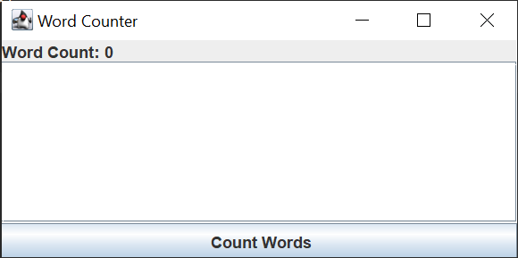

# codealpha_tasks
Repo for Code Alpha Java Tasks

## Task #1

Created a java project using Swing that prompts a user a window to input words, and the application counts the number of words typed in and returns that number

  
